# Active Directory Homelab Project

## Table of Contents
- [Project Overview](#project-overview)
- [Environment Overview](#environment-overview)
- [Installation & Configuration](#installation--configuration)
- [Organizational Structure](#organizational-structure)
- [Group Policy Objects](#group-policy-objects)
- [IT Helpdesk Scenarios](#it-helpdesk-scenarios)
- [Lessons Learned](#lessons-learned)

---

## Project Overview

### Purpose
[Brief explanation of why you built this lab and what skills you aimed to develop]

### Key Objectives
- Deploy and configure Active Directory Domain Services
- Implement organizational units and group policies
- Simulate real-world IT helpdesk scenarios
- Practice user and computer management

---

## Environment Overview

### Network Diagram


**Network Configuration:**
- **Subnet:** 172.29.144.0/20
- **Domain Controller IP:** 172.29.144.10 (Static)
- **Client Workstation IP:** 172.29.144.20 (Static)
- **Host Machine IP:** 172.29.144.1
- **Domain Name:** HELPLAB.local

### Hardware & Virtualization Specifications

#### Host Machine
- **RAM:** 16 GB
- **CPU:** 4 cores / 8 threads
- **Storage:** 1 TB SSD
- **Hypervisor:** Microsoft Hyper-V
- **Operating System:** Windows 11 Pro

#### Domain Controller VM (Windows Server 2022)
- **Hostname:** WIN-MEUJ3KPDEG5
- **Operating System:** Windows Server 2022 Standard
- **RAM:** 4 GB
- **vCPU:** 4 cores
- **Storage:** 60 GB virtual disk
- **Network:** Hyper-V Default Switch
- **IP Address:** 172.29.144.10/20 (Static, no gateway)

#### Client Workstation VM (Windows 11 Pro)
- **Hostname:** WIN11-CLI-01
- **Operating System:** Windows 11 Pro
- **RAM:** 4 GB
- **vCPU:** 4 cores
- **Storage:** 60 GB virtual disk
- **Network:** Hyper-V Default Switch
- **IP Address:** 172.29.144.20/20 (Static, no gateway)

### Server Roles & Services

The Domain Controller hosts multiple roles:
- **Active Directory Domain Services (AD DS)** - Directory services and domain management
- **DNS Server** - Name resolution for the domain
- **File and Storage Services** - Shared folders and file permissions
- **Group Policy Management** - Centralized policy deployment

---

## Installation & Configuration

### 1. Installing Active Directory Domain Services

#### Step 1: Add the AD DS Role
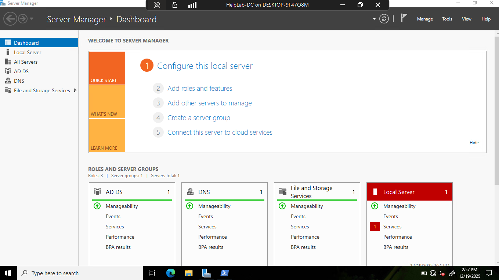
*Open Server Manager and click "Add roles and features"*


*Click Manage in the upper right-hand corner and select "Add roles and features"*


*Select Next*

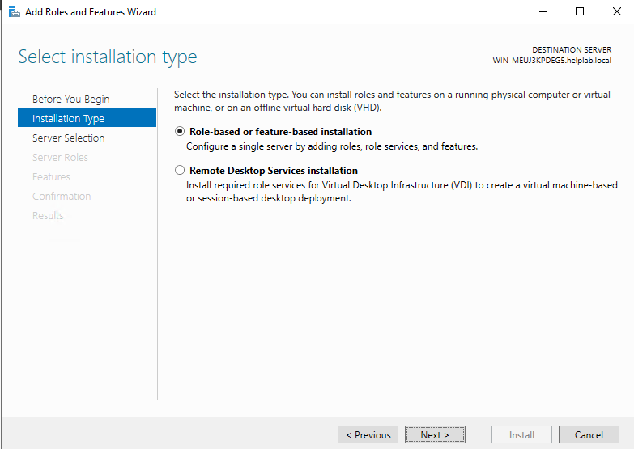
*Select "Role-based or feature-based installation" and click "Next"*

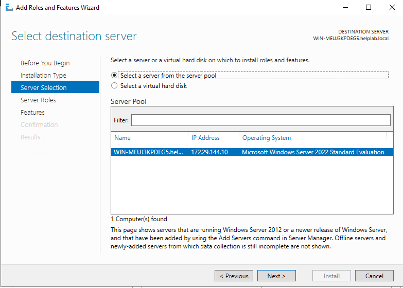
*Click "Select a server from server pool" and select intended server from server pool. Click "Next"*


*Ensure both roles: "Active Directory Domain Services" and "DNS Server" are checked. Click "Next"*

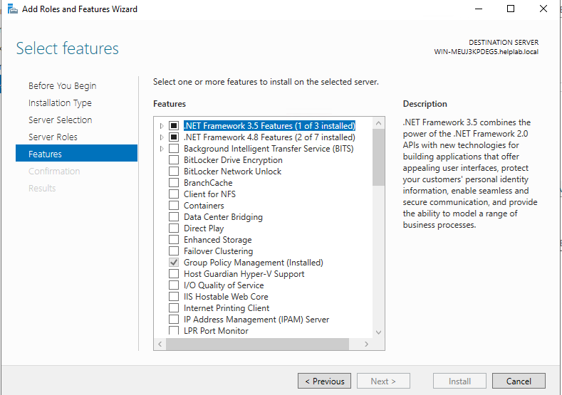
*Ensure that "Group Policy Management" is checked. Click "Next".*

#### Final Steps:
*Confirm the installation selections and click "Install".*
*Once installation is successful, proceed to DC promotion.*

---

### 2. Promoting Server to Domain Controller

#### Step 1: Post-Deployment Configuration

*Select "Promote this server to a domain controller"*

#### Step 2: Deployment Configuration

*Select "Add a new forest" and enter your root domain name (e.g., homelab.local)*

#### Step 3: Domain Controller Options

*Set Forest and Domain functional levels, configure DSRM password*

#### Step 4: Review and Install
*Review all options and click "Next" through prerequisite checks*
*Click "Install" once all checks pass successfully*

**Note:** The server will automatically reboot after promotion. Log in using the domain administrator account (DOMAIN\Administrator).

---

### 3. DNS Configuration

To configure the DC as the primary DNS server for the network:

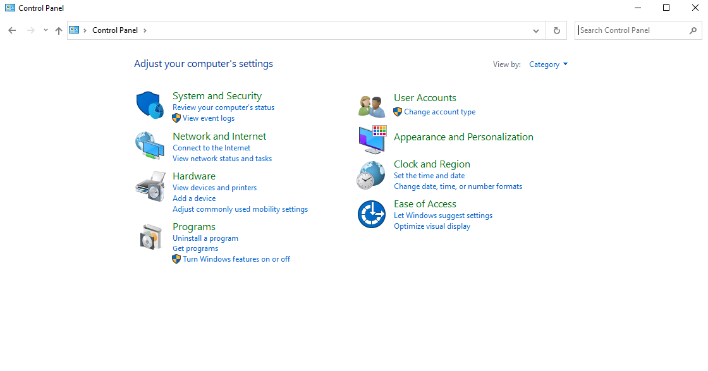
*Navigate to Control Panel > Network and Internet*


*Navigate to Network and Sharing Center*


*Select "Change adapter settings" in the side panel*

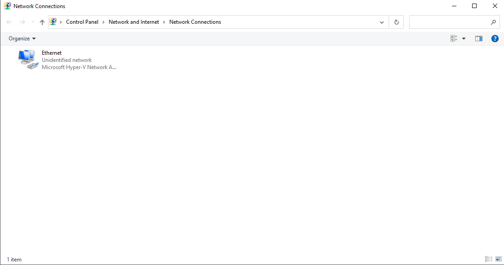
*Double-click "Ethernet"*


*Select "Properties"*

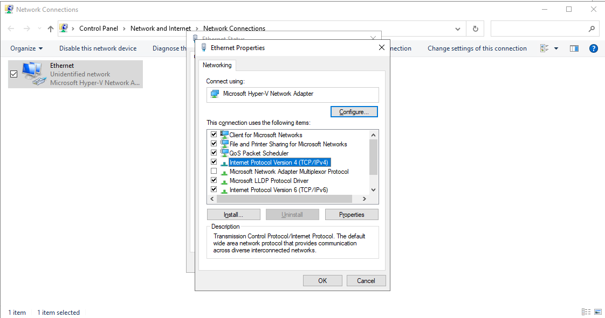
*Select "Internet Protocol Version 4 (TCP/IPv4)" and click "Properties"*

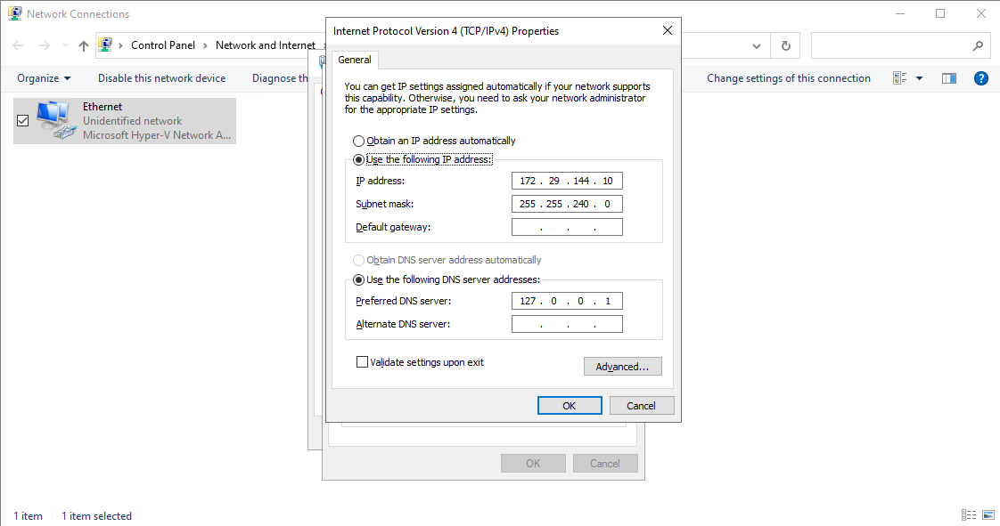
*Enter in desired static ip address and subnet mask. Leave default gateway empty. Set preferred DNS server to 127.0.0.1 .*
*Click "OK" and run `nslookup` in command prompt to verify DNS resolution*

---

## Organizational Structure

### Organizational Unit (OU) Design

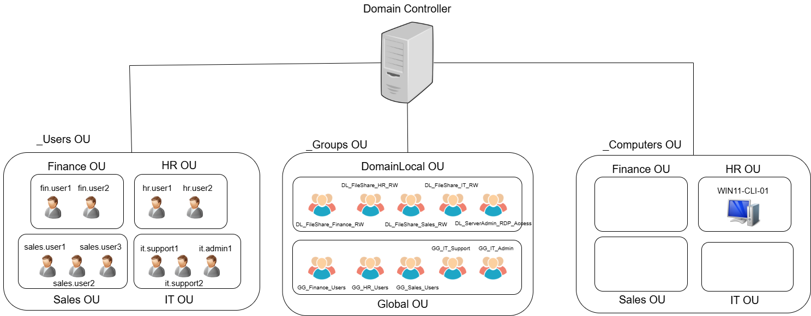

#### Design Rationale

The OU structure is designed to mirror a typical small business organization.
Three-Tier Organizational Structure:
1. _Users OU
- Contains all user accounts organized by department.
- Enables department specific user configurations (e.g. Drive Mapping)
2. _Groups OU
- Subdivided into DomainLocal OU and Global OU.
- Domain Local Groups (DL_*): Used to assign permissions to resources (e.g. file shares)
- Global Groups (GG_*): Contains user members organized by department/function.
3. _Computers OU
- Contains all workstations organized by department.
- Enables department specific computer configurations (e.g. Security Settings)

This structure avoids directly assigning permissions to individual users and provides a scalable, maintainable approach to access management.

---

### Group Architecture


#### Design Rationale
This implements the AGDLP (Account, Global, Domain Local, Permission) best practice:
- Accounts (users) -> added to -> Global groups -> nested in -> Domain Local groups -> assigned Permissions.
- Each department has access to its own shared drive, with the exception of the sales department.
- The IT admin can access the shared drive of the IT department and has permission to remote access servers whereas IT support users may only access the shared drive.

This approach simplifies permission management and scales well as the organization grows.

---

## Group Policy Objects

### 1. Account Lockout Policy

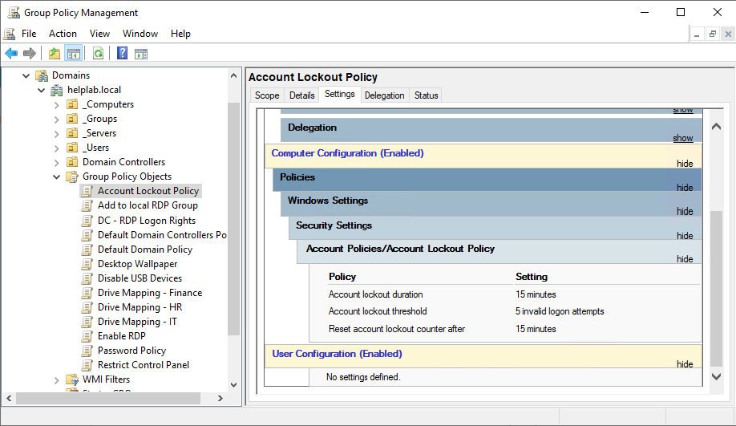

**Purpose:** Protect against brute-force password attacks

**Configuration:**
- **Account lockout threshold:** 5 invalid logon attempts
- **Account lockout duration:** 30 minutes
- **Reset account lockout counter after:** 30 minutes

**Applied to:** Default Domain Policy (all domain users)

---

### 2. Password Policy


**Purpose:** Enforce strong password requirements across the domain

**Configuration:**
- **Minimum password length:** 12 characters
- **Password complexity requirements:** Enabled
- **Maximum password age:** 90 days
- **Minimum password age:** 30 days

**Applied to:** Default Domain Policy (all domain users)

---

### 3. Desktop Wallpaper Policy

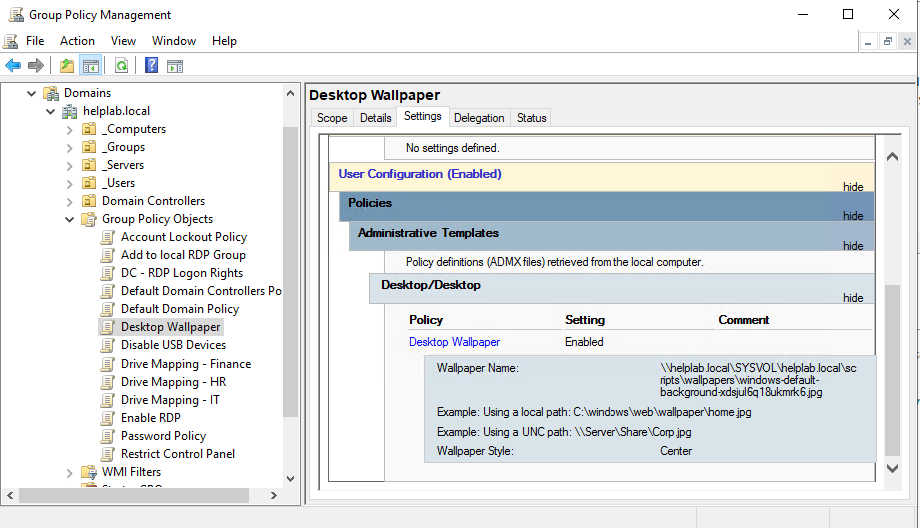

**Purpose:** Standardize desktop appearance.

**Configuration:**
- **Wallpaper path:** \\\\helplab.local\\SYSVOL\\helplab.local\\scripts\\wallpapers\\company_wallpaper.jpg
- **Wallpaper style:** Center

**Applied to:** _Users OU

---

### 4. Disable USB Storage Devices


**Purpose:** Prevent data exfiltration and malware introduction via USB drives

**Configuration:**
- **All Removable Storage Classes: Deny all access** Enabled

**Applied to:** HR, Finance, and Sales OUs

**Note:** IT department is excluded from this policy to allow administrative tasks.

---

### 5. Restrict Control Panel Access

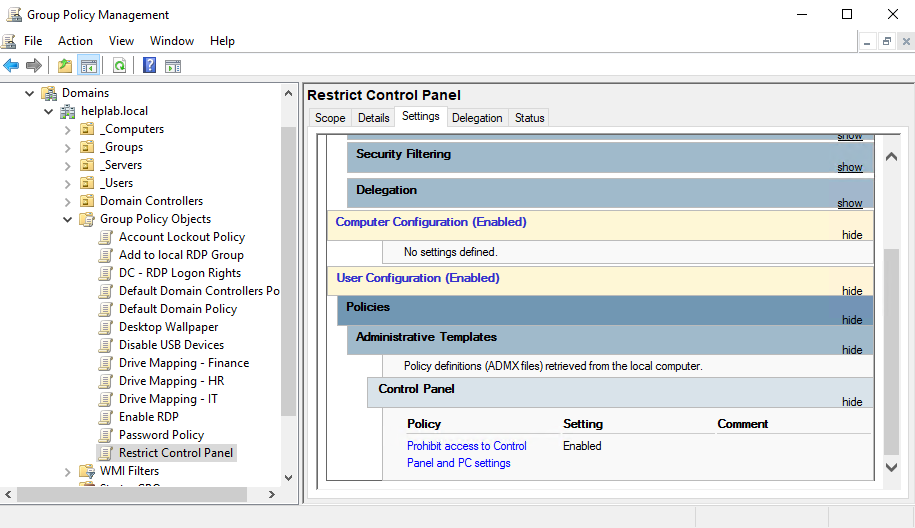

**Purpose:** Limit user ability to modify system settings

**Configuration:**
- **Prohibit access to Control Panel and PC Settings:** Enabled

**Applied to:** HR, Finance, and Sales OUs (non-IT staff)

---

## IT Helpdesk Scenarios

### Scenario 1: Password Reset Request

**Ticket:** User Sarah Johnson (HR) forgot her password and is locked out

**Resolution Steps:**
1. Verified user identity through security questions
2. Opened Active Directory Users and Computers (ADUC)
3. Located user account in HR Staff OU
4. Right-clicked account → Reset Password
5. Set temporary password and enabled "User must change password at next logon"
6. Unlocked the account (if locked due to failed attempts)
7. Communicated temporary password securely to user
8. Verified user could log in and change password

**Screenshots:**

*Account showing locked status before reset*


*Resetting password and unlocking account*


*User successfully logged in with new password*

**Time to Resolution:** 5 minutes

---

### Scenario 2: New User Onboarding

**Ticket:** New hire John Smith joining Finance department - needs AD account and access to Finance shared folder

**Resolution Steps:**
1. Opened ADUC and navigated to Finance Staff OU
2. Created new user account:
   - Username: jsmith
   - Full name: John Smith
   - Email: jsmith@homelab.local
   - Initial password set with "must change at next logon"
3. Added user to Finance_Department security group
4. Configured profile settings (home folder path)
5. Verified group membership and permissions
6. Tested login from client workstation
7. Confirmed access to Finance shared folder
8. Notified manager that account is ready

**Screenshots:**

*Creating new user account in Finance OU*


*Adding user to Finance_Department group*


*Verifying access to Finance shared resources*

**Time to Resolution:** 10 minutes

---

### Scenario 3: User Offboarding

**Ticket:** Employee Jane Doe (IT Department) has left the company - disable account and archive data

**Resolution Steps:**
1. Opened ADUC and located Jane Doe's account in IT Staff OU
2. Disabled the user account (right-click → Disable Account)
3. Updated account description with termination date and ticket number
4. Removed user from all security groups except Domain Users
5. Moved account to "Disabled Users" OU
6. Documented group memberships before removal
7. Reset password for security purposes
8. Backed up user's home folder to archive location
9. Notified manager and IT team of completion

**Screenshots:**

*Disabling terminated employee account*


*Moving disabled account to Disabled Users OU*


*Updated description documenting termination*

**Time to Resolution:** 15 minutes

---

### Scenario 4: Computer Unable to Join Domain

**Ticket:** New workstation CLIENT02 cannot join the domain - receiving error message

**Resolution Steps:**
1. Verified network connectivity between client and DC (ping test)
2. Confirmed DNS settings point to DC (172.29.144.10)
3. Verified DC DNS records are correct in DNS Manager
4. Used `nslookup` to test domain name resolution from client
5. Checked that computer name doesn't already exist in AD
6. Attempted domain join with domain admin credentials
7. Reviewed error message - found workstation had incorrect DNS server
8. Corrected DNS server setting to point to DC
9. Successfully joined computer to domain
10. Moved computer object to appropriate OU (IT Department workstations)
11. Restarted computer and verified domain login

**Screenshots:**

*Initial domain join failure error*


*Testing DNS resolution with nslookup*


*Computer successfully joined to domain*

**Time to Resolution:** 20 minutes

---

### Scenario 5: Group Policy Not Applying

**Ticket:** User reports that desktop wallpaper policy is not applying to their workstation

**Resolution Steps:**
1. Logged into affected client workstation
2. Opened Command Prompt as administrator
3. Ran `gpupdate /force` to force policy refresh
4. Ran `gpresult /r` to view applied policies
5. Found that computer object was in wrong OU (not linked to wallpaper GPO)
6. Moved computer to correct OU in ADUC
7. Ran `gpupdate /force` again on client
8. Verified policy application with `gpresult /h report.html`
9. Confirmed wallpaper changed after reboot
10. Documented issue and resolution

**Screenshots:**

*Checking applied policies with gpresult*


*Moving computer to OU with proper policy links*


*Verified wallpaper policy applied correctly*

**Commands Used:**
```cmd
gpupdate /force
gpresult /r
gpresult /h C:\report.html
```

**Time to Resolution:** 12 minutes

---

### Scenario 6: Shared Folder Permission Issue

**Ticket:** User cannot access Finance shared folder despite being in Finance_Department group

**Resolution Steps:**
1. Verified user's group membership in ADUC
2. Confirmed user is member of Finance_Department security group
3. Checked NTFS permissions on shared folder
4. Checked Share permissions on folder
5. Found that Finance_Department group had Read permissions but user needed Modify
6. Updated Finance_Department permissions to "Modify" on NTFS level
7. Informed user that permissions may take effect after logout/login
8. User logged out and back in
9. Verified user can now read, write, and modify files in shared folder
10. Tested with creating and deleting test file

**Screenshots:**

*Confirming user is in correct security group*


*Reviewing and updating folder permissions*


*User successfully accessing shared folder*

**Time to Resolution:** 10 minutes

---

## Lessons Learned

### Technical Skills Gained
- [List specific technical skills you developed]
- Installed and configured Active Directory Domain Services from scratch
- Designed and implemented OU structure following best practices
- Created and linked Group Policy Objects for security and standardization
- Troubleshot common AD issues using built-in tools (gpresult, nslookup, etc.)

### Challenges Encountered
- Encountered issues with remote access due to installing portable version of OpenSSH.
- Initial DNS configuration issues causing domain join failures - resolved by properly configuring DNS forwarders

---

## Conclusion

This Active Directory homelab provided hands-on experience with core identity and access management concepts used in enterprise environments. The combination of setup, configuration, and simulated helpdesk scenarios demonstrates both technical knowledge and practical troubleshooting skills essential for IT support roles.
